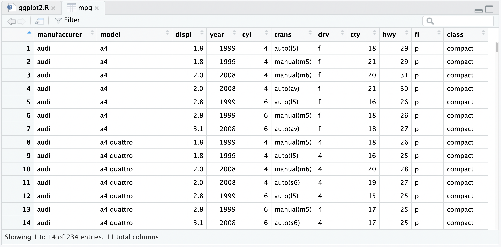

The following documentation walks through an example of using the `ggplot2` R package and Posit Cloud/RStudio for basic data visualization. If you are relatively new to R and want to learn more about using R for Data Science, also see the [R for Data Science](https://r4ds.hadley.nz/) textbook which is available in [print](https://www.oreilly.com/library/view/r-for-data/9781492097396/) or as a [freely available website](https://r4ds.hadley.nz/)

`ggplot2` is part of the `tidyverse` ecosystem of packages.

> The tidyverse is an opinionated [**collection of R packages**](https://www.tidyverse.org/packages) designed for data science. All packages share an underlying design philosophy, grammar, and data structures.

## Hello RStudio

RStudio is an integrated development environment (IDE) designed to help you be more productive in your daily data science work.

In our class, we will be using the Posit Cloud interface to access [R](https://cloud.r-project.org/) and [RStudio](https://posit.co/downloads/), so you don't need to install anything locally on your device.

When you start a new project in Posit Cloud/RStudio (for example by clicking on an assignment we have created in our Posit Cloud class workspace), you'll see four key regions or "panes" in the interface: the Source pane, the Console pane, the Environment pane and the Output Pane.

### RStudio Panes

1.  The **Source pane** is where you can edit and save R or Python scripts or author computational documents like Quarto and R Markdown.

2.  The **Console pane** is used to write short interactive R commands.

3.  The **Environment pane** displays temporary R objects as created during that R session.

4.  The **Output pane** displays the plots, tables, or HTML outputs of executed code along with files saved to disk.

{fig-alt="A screenshot of the RStudio UI. There are 4 primary panes, the source, console, environment, and output panes."}

### Hello RStudio Projects

RStudio projects make it straightforward to divide your work into multiple contexts, each with their own working directory, workspace, history, and source documents.

In our class, you will create a new project for each assignment through our Posit Cloud workspace. This project will include the initial code and data sets that you will need to complete your work.

RStudio projects give you a solid workflow that will serve you well in the future:

-   Create an RStudio project for each data analysis project.

-   Keep data files there; we'll talk later about loading them into R.

-   Keep scripts there; edit them, run them in bits or as a whole.

-   Save your outputs (plots and cleaned data) there.

Everything you need is in one place, and cleanly separated from all the other projects that you are working on.

## Hello `ggplot2`

The following section is adapted from the ["Data Visualization" chapter](https://r4ds.hadley.nz/data-visualize) of R for Data Science.

> R has several systems for making graphs, but `ggplot2` is one of the most elegant and most versatile.

Let's get started creating a basic graph with R via `ggplot2`.

Because we will be using the `tidyverse` family of packages repeatedly in our course, they come installed with any project you create through our course workspace by default. This means you do not need to install them.

However, you do need to load it with `library()` every time you start a new session.

-   In RStudio, go to the `Files` tab in the **Output Pane** and click on `ggplot2.R`.

The `ggplot2.R` file will open in the **Source Pane**, which by default is in the top left.

Since the `tidyverse` is already installed in your project, you can execute the following code on the first line of your `ggplot2.R` script to load the `tidyverse` packages for that session.

``` r
library(tidyverse)
```

The `library()` function will load a specific R package (`tidyverse`) so you can use the R functions within it. In the case of `tidyverse`, a set of packages are actually loaded, including the `ggplot2` package which contains many functions for creating useful and elegant graphs in R.

To execute that code in the R console, you can move your cursor to the specific line of code and either use the Run command in RStudio or the <kbd>`Ctrl + Enter`</kbd> (<kbd>`Cmd + Enter`</kbd> on Mac) shortcut.

### First Steps

Let's use our first graph to answer a question:

> Do cars with big engines use more fuel (per mile) than cars with small engines?

We will be looking at the `mpg` data frame built into `ggplot2`. A data frame is a rectangular collection of variables (in the columns) and observations (in the rows). mpg contains observations collected by the US Environmental Protection Agency on 38 car models.

We can temporarily save this data frame object in R to our **Environments pane** by assigning it with the `<-` operator. Objects in the **Environment pane** are available for the duration of the current session, but are removed upon restarting R or RStudio.

As a beginning R user, it's OK to consider your environment (i.e. the objects listed in the environment pane) "real". However, in the long run, you'll be much better off if you consider your R scripts as "real". With your R scripts (and your data files), you can recreate the environment. It's much harder to recreate your R scripts from your environment!

``` r
# this will temporarily assign the mpg dataset 
# to the mpg object in our current session
mpg <- ggplot2::mpg
```

### Display the data

You can then display the first few rows of the `mpg` dataframe like so:

``` r
head(mpg)
```

``` r
#> # A tibble: 6 × 11
#>   manufacturer model displ  year   cyl trans      drv     cty   hwy fl    class  
#>   <chr>        <chr> <dbl> <int> <int> <chr>      <chr> <int> <int> <chr> <chr>  
#> 1 audi         a4      1.8  1999     4 auto(l5)   f        18    29 p     compact
#> 2 audi         a4      1.8  1999     4 manual(m5) f        21    29 p     compact
#> 3 audi         a4      2    2008     4 manual(m6) f        20    31 p     compact
#> 4 audi         a4      2    2008     4 auto(av)   f        21    30 p     compact
#> 5 audi         a4      2.8  1999     6 auto(l5)   f        16    26 p     compact
#> 6 audi         a4      2.8  1999     6 manual(m5) f        18    26 p     compact
```

Among the variables in `mpg` are:

1.  `displ`, a car's engine size, in liters.

2.  `hwy`, a car's fuel efficiency on the highway, in miles per gallon (mpg). A car with a low fuel efficiency consumes more fuel than a car with a high fuel efficiency when they travel the same distance.

To get more of a spreadsheet "view" of the data, you can use the `View()` function:

``` r
View(mpg)
```

This will open up a new tab in the **Source pane** titled "mpg". You can explore the data here interactively. To get back to your "ggplot2.R" file, select the `ggplot2.R` tab in the **Source pane**.

{fig-alt="A screenshot of the output of `View(mpg)` which creates a spreadsheet-like view of the mpg dataset."}

### Create a graph

Next, in your `ggplot2.R` file in the source pane, you can type the following code:

``` r
mpg_plot <- ggplot(data = mpg, mapping = aes(x = displ, y = hwy)) +
  geom_point(mapping = aes(colour = class)) +
  geom_smooth(method = "lm", formula = "y ~ x")
```

Again, you will want to execute that by either the Run command or shortcut (<kbd>`Ctrl + Enter`</kbd> or <kbd>`Cmd + Enter`</kbd> on Mac). Note that we are using the `<-` operator to assign this plot to the `mpg_plot` object. The `mpg_plot` object will be visible in the top right **Environment Pane**.

{fig-alt="A screenshot of the Environments pane, showing the mpg and mpg_plot objects"}

### Print the graph

To print the graph in the **Output Pane**, we can add and then execute one more line of code:

``` r
mpg_plot
```

That will then display the plot into the **Output Pane** \> **Plots** tab.

{fig-alt="A ggplot of fuel displacement on the x-axis and highway miles per gallon on the y-axis. There is a negative, roughly linear relationship between mpg and displacement, as fuel displacement increases, the highway mpg decreases. The points are colored by class of vehicle, where pickups and SUVs have larger engines and worse fuel-efficiency than subcompact, compact, or midsize vehicles."}

The plot shows a negative relationship between engine size (`displ`) and fuel efficiency (`hwy`). In other words, cars with smaller engine sizes have higher fuel efficiency and, in general, as engine size increases, fuel efficiency decreases. Does this confirm or refute your hypothesis about fuel efficiency and engine size?

### Save the graph

Lastly, we may want to save this image as proof of our hardwork! We can use `ggplot2` to save the image to disk with the below code *or* use the Export button in the **Plot Pane**.

``` r
ggsave("my-first-plot.png", plot = mpg_plot, height = 4, width = 6)
```

Now that the file has been saved to disk, we can find it by switching from the **Plot tab** to the **Files tab**, both of which are located by default in the **Output Pane**.

Because we are working in Posit Cloud, this plot is not stored on your local device. To save it for inclusion in a document (like one of your project reports), you'll want to click the box next to `my-first-plot.png` in the Files tab, then click the **gear icon** and select `Export...`. This will allow you to save the file to your downloads, and then include it in your local work.

## Good project hygiene

Remember - with your R scripts and data files you can recreate this temporary session environment! To prove our point, after you have saved your `ggplot2.R` file, restart your session with the RStudio menu: **Session \> Restart R**. Even in this fresh environment, you can recreate your plot by re-executing the source code with the same data!

In general, the goal is to be able to do this for any project you are working on: your script should contain all the steps you followed to produce your results and you should be able to start from scratch and reproduce everything (without anything changing).

## Closing

While this exercise may have seemed simple, we have learned quite a few things about RStudio:

There are 4 core panes for managing data analysis tasks

1.  The **Source Pane** is used to write longer scripts that can executed line-by-line or be saved to disk
2.  The **Console Pane** is used to execute short interactive code
3.  The **Environment Pane** is used to temporarily store session objects
4.  The **Output Pane** contains the **Plot tab** which display graphs, and the **Files tab** which lets you explore source code and output files.

To go deeper on learning about `ggplot2` and the rest of the `tidyverse` please see the R for Data Science textbook. R for Data Science is available in [print](https://www.oreilly.com/library/view/r-for-data/9781492097396/) or as a [freely available website](https://r4ds.hadley.nz/)

